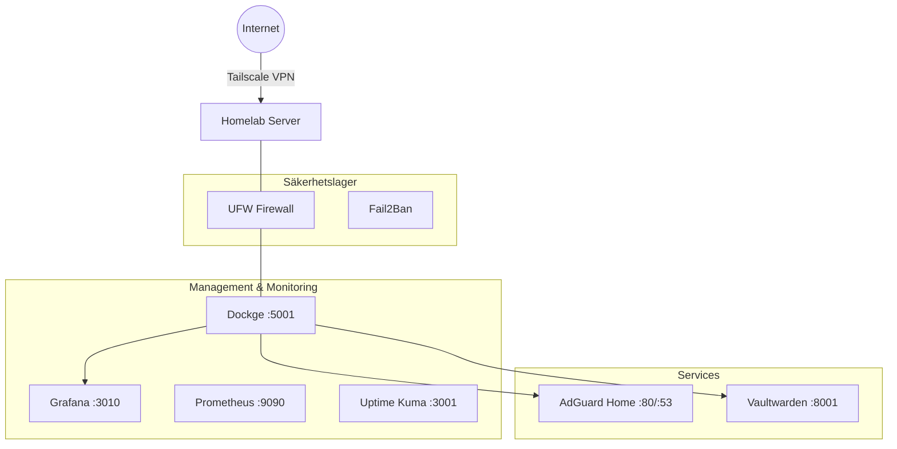

[](https://github.com/Thomas-3145/homelab-infrastructure/actions/workflows/ci.yml)  

# 🏡 3145 Home Server Infrastructure

Detta repo innehåller "Infrastructure as Code" (IaC) för min privata hemmaserver.
Syftet med projektet är att automatisera drift, övervakning och säkerhet, samt att simulera en produktionsliknande miljö för DevOps-lärande.

Servern är byggd på en **Raspberry Pi 5** med fokus på prestanda (NVMe), säkerhet (Hardening) och transparens.

## 🛠 Teknisk Stack

- **Hårdvara:** Raspberry Pi 5 (8GB) i Argon ONE V3-chassi.
- **OS:** Raspberry Pi OS / Debian Bookworm (aarch64).
- **Orchestration:** Docker Compose hanterat via **Dockge**.
- **CI/CD:** GitHub Actions (Self-hosted runner).
- **Nätverk:** Tailscale (Zero-trust mesh VPN).
- **Övervakning:** Prometheus, Grafana, Node Exporter, cAdvisor & Uptime Kuma.

## 📊 Hårdvara & Lagring

Systemet körs på dedikerad hårdvara optimerad för stabilitet och I/O-prestanda.

| Komponent | Modell / Specifikation |
|-----------|------------------------|
| **SBC** | Raspberry Pi 5 (8GB RAM, ARM Cortex-A76) |
| **Chassi** | Argon ONE V3 M.2 NVMe (Aktiv kylning + Script-styrning) |
| **Lagring** | NVMe SSD via PCIe (Root FS + Docker Volumes) |
| **Ström** | Officiell 27W USB-C PSU (För NVMe-stabilitet) |

## 🏗 Arkitektur



## 📂 Repository Struktur

Projektet följer en strikt mappstruktur för separation of concerns:

```
.
├── docker/                  # Docker Compose stacks (styrda av Dockge)
│   ├── dockge/              # Management UI (Hjärtat i systemet)
│   ├── monitoring/          # Prometheus, Grafana, Node Exporter
│   ├── adguard/             # DNS Ad-blocking
│   └── vaultwarden/         # Password Manager
├── scripts/                 # Automation & Maintenance
│   ├── 00_bootstrap.sh      # Initiering av ny server
│   ├── 01_setup.sh          # Installation av paket & Docker
│   ├── 02_hardening.sh      # Säkerhet (SSH portbyte, UFW, Fail2Ban)
│   ├── 03_pi5_extras.sh     # Drivrutiner för Argon ONE / Pi 5
│   ├── 10_backup.sh         # Backup-rutin
│   ├── 11_update.sh         # System & Container uppdateringar
│   └── health_check.py   # Python-baserad hälsokontroll
└── docs/                    # Djupgående dokumentation
```

## 🚀 Quick Start (Ny Server)

För att sätta upp en helt ny server från noll, används bootstrap-scriptet. Det klonar repot, installerar Docker, sätter upp säkerhet och installerar drivrutiner.

```bash
# Ladda ner och kör bootstrap
curl -sSL [https://raw.githubusercontent.com/Thomas-3145/homelab-infrastructure/main/scripts/00_bootstrap.sh](https://raw.githubusercontent.com/Thomas-3145/homelab-infrastructure/main/scripts/00_bootstrap.sh) | bash
```

*Följ instruktionerna på skärmen för att välja SSH-port och aktivera härdning.*

## ⚙️ Drift & Underhåll

Systemet är designat för att vara självgående, men följande verktyg finns för manuell hantering:

### Uppdateringar
Servern uppdaterar containers automatiskt via **Watchtower**. För att uppdatera OS, Repo och tvinga en kontroll manuellt:
```bash
./scripts/11_update.sh
```

### Backup
Backuper körs på hela `docker`-mappen (konfigurationer och volymer).
```bash
./scripts/10_backup.sh
```
*Backuper sparas lokalt i `./backups/` med 7 dagars retention.*

### Hälsokontroll
Ett Python-script som ger en ögonblicksbild av systemets status (Temp, RAM, Disk, Tjänster).
```bash
./scripts/12_health_check.py
```

## 🔒 Säkerhet

Säkerheten är implementerad i lager ("Defense in Depth"):

1.  **Nätverk:** Inga portar öppna mot internet. All åtkomst sker via **Tailscale**.
2.  **SSH:** Flyttad till custom port **22456** (konfigureras i `02_hardening.sh`).
3.  **Brandvägg:** UFW blockerar allt inkommande utom specifika tjänster.
4.  **Intrångsskydd:** Fail2Ban övervakar SSH och bannlyser IP-adresser vid upprepade misslyckanden.
5.  **Hemligheter:** `.env`-filer är exkluderade från Git.

## 📈 Roadmap

- [x] Migrera från Portainer till Dockge.
- [x] Implementera Prometheus & Grafana.
- [x] Automatisera backupscripts.
- [x] Hårdvaruspecifika scripts för Pi 5 (Fan control).
- [ ] Utöka CI/CD för att linta Docker Compose-filer.
- [ ] Konfigurera fjärr-backup (Off-site).

## 📝 Licens
MIT
